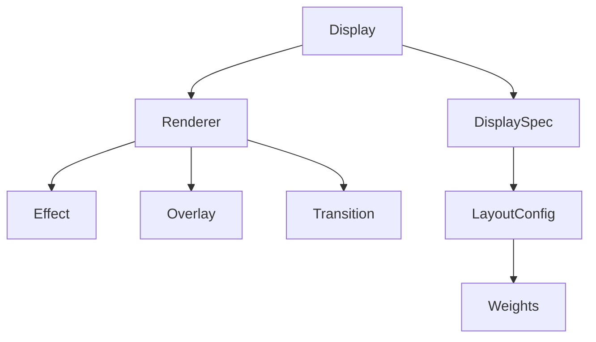

[Home](Home.md) | [DisplaySpec](DisplaySpec.md) | [Effects](Effects.md) | [Overlays](Overlays.md) | [Transitions](Transitions.md)

# LED Segments Wiki

Welcome to the **LED Segments** documentation. This library is designed to help you create complex, layered, and hardware-agnostic LED animations on Arduino-compatible boards using modern C++17.

## Core Philosophy

Most LED libraries force you to think in terms of physical LED indices (`leds[0]`, `leds[1]`, ...). This becomes painful when:
1.  Your physical wiring is messy or non-linear.
2.  You want to run the same "Chase" effect on a straight strip, a circle, and a matrix.
3.  You want to layer effects (e.g., a background rainbow + foreground sparkles).

**LED Segments** solves this by introducing an abstraction layer:
*   **Physical Layer**: Your actual hardware (pins, LED count).
*   **Logical Layer**: "Segments" and "Pixels" that effects draw onto.
*   **Mapping Layer**: A user-defined function that translates Logical Pixels -> Physical LEDs.

## Table of Contents

### 1. [DisplaySpec](DisplaySpec.md)
The heart of your project. This is where you define your hardware configuration and the mapping logic. Learn how to:
*   Configure pins and LED types.
*   Define multiple "Layouts" for the same physical strip.
*   Map logical pixels to physical LEDs.

### 2. [Effects](Effects.md)
The base layer of your visual output. Learn about:
*   The built-in effects (Rainbow, Noise, Plasma, etc.).
*   How effects are rendered onto segments.
*   How to create your own custom effects.

### 3. [Overlays](Overlays.md)
Visual modifiers that sit on top of effects. Learn how to:
*   Add sparkles, waves, or glitches to any effect.
*   Understand blending modes (Add, Multiply, Screen).
*   Use overlays to create depth and texture.

### 4. [Transitions](Transitions.md)
The logic for switching between visual states. Learn about:
*   Smooth cross-fades and wipes.
*   How the engine handles the "old" and "new" frame during a transition.

## Architecture Overview

*   **Display**: The main controller. It manages the loop and decides when to switch effects.
*   **Renderer**: The graphics pipeline. It asks the Effect, Overlay, and Transition to draw themselves and blends the result.
*   **DisplaySpec**: Your code. It tells the Display how to talk to your LEDs.
